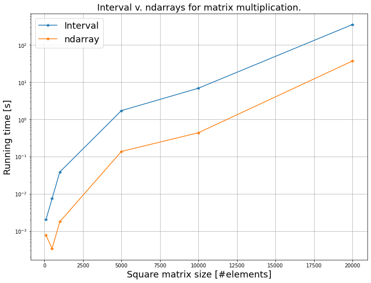

[](https://codecov.io/gh/marcodeangelis/intervals)


# Welcome!
*intervals* is a library for interval computing in Python.

The library implements optimized interval arithemtic between array-like structures. Optimization is achieved running Numpy under the hood. An `Interval` object is--in essence--a wrapper of an `ndarray`. So just like an `ndarray` an `Interval` is iterable, indexable, and computations are element-wise unless otherwise specified.

This is an __open source project__: we welcome contributions to enlarge and improve this code. If you see any error or problem, please open a new issue. If you want to join our team of developers, get in touch!

Disclaimer: This implmentation of interval arithmetic is rigorous in the sense of *inclusive* but not in the sense of *verified*. 

## When to use this code
* When interval arithmetic is needed between array-like structures. 
* For intrusive uncertainty propagation. 
* For rigorous bounding, although additional dependency tracking is needed to compute best-possible bounds.

## When **not** to use this code
* __Verified computing__ is not yet implemented, so if you need verified computations and outward-directed rounding you should use other software like: [IntLab](https://www.tuhh.de/ti3/rump/intlab/) or [Julia Intervals](https://juliaintervals.github.io).


## Why use this code
* It's free. 
* It's optimized for vector and matrix computations.

## Future work
* Keep adding more operations and functions.
* Add support for outward directed rounding, and comply with the IEEE standard on interval arithmetic.

## Contact
You can reach us at `mda@liverpool.ac.uk`.

## References


# Installation
First, download or clone this repository on your local machine.

If you don't have Github ssh keys (you may have to enter your github password) use:
`git clone  https://github.com/marcodeangelis/intervals.git`

Otherwise:

`git clone git@github.com:marcodeangelis/intervals.git`


```
If you don't have a Github account, just click on the code green button, and hit Download. This will zip and download the code in your designated downloads folder.
```

Then, open a code editor in the cloned or downloaded folder. 

## Dependencies

There is only one mandatory dependency to use `intervals`. So the `requirements.txt` is the one liner:

```
numpy>=1.22
```

However, we recommend installing also `matplotlib` for plotting. 

### Virtual environment

Set up your Python3 virtual environment to safely install the dependencies.

On MacOS/Linux:

```bash
$ python3 -m venv myenv 

$ source myenv/bin/activate 

# On Windows replace the second line with: $ myenv\Scripts\activate

(myenv) $ pip install -r requirements.txt
```

# Intervals

Let's see what this code in action.


## Importing the code
```python
from intervals.number import Interval as I
from intervals.methods import (lo,hi,mid,rad,width,intervalise)
from tests.interval_generator import pick_endpoints_at_random_uniform
```


## Arithmetic between scalar intervals

Intervals are created using the endpoints notation. So let `x=[1,2]` and `y=[-3,-2]` be two scalar intervals:

```python
x=I(1,2)
print(x)
# [1.0,2.0]
y=I(-3,-2)
print(y)
# [-3.0,-2.0]
```

the four arithmetic operations between `x` and `y` are:

```python
print(x+y)
# [-2.0,0.0]
print(x-y)
# [3.0,5.0]
print(x*y)
# [-6.0,-2.0]
print(x/y)
# [-1.0,-0.33]
```

We can check that these operations are correct with __endpoints analysis__. For example, the addition is:

```python
xe = [lo(x),hi(x)]
ye = [lo(y),hi(y)]
xye= [xc+yc for xc in xe for yc in ye ]
print(min(xye))
# -2.0
print(max(xye))
# 0.0
```

## Properties of scalar intervals

We can also check that `x` and `y` are scalar with the property `scalar`:

```python
x.scalar
# True
```

`x` and `y` are unsized scalars, which means they cannot be iterated:

```python
print(len(x))
# 0
```
We can check if an interval is iterable with the property `unsized`:

```python
print(x.unsized)
# True
```
Unsized intervals have an empty shape just like ndarrays:

```python
x.shape
# ()
```

and have a length `0`:

```python
len(x)
# 0
```

Scalar intervals can also be iterable or sized. For example, we could define a scalar interval as:

```python
x_ = I([1],[2])
```
So `x_` is just like `x=[1,2]` in terms of computations, with the only difference of being sized. So the scalar interval `x_` is now 

(1) indexable, 

(2) iterable, and 

(3) sized:

```python
print(x_.scalar) # (0) scalar
# True
print(x_[0]) # (1) indexable
# [1.0,2.0]
for xi in x: # (2) iterable
    print(x)
# [1.0,2.0]
print(len(x)) # (3) sized
# 1
```

## Arithmetic between array-like intervals

Array-like intervals are intervals which  endpoints are array-like structures. We can define arrays of different shapes, for example:

(1) array of shape (n,) or __vector__ or __1d array__

(2) array of shape (n,m) or __matrix__ or __2d array__

(3) array of shape (n,m,o) or __3d array__

(4) array of shape (n,m,...) or __Nd array__

All computations between array-like intervals are done elementwise, unless otherwise specified.

Two interval vectors `x` and `y` can be defined as follows:

```python
x = I(lo=[1,2,3,4],hi=[2,3,4,5])
print(x)
# [1.0,2.0]
# [2.0,3.0]
# [3.0,4.0]
# [4.0,5.0]
y = I(lo=[-1,-2,-3,-4],hi=[-1,-1,-1,-1])
print(y)
# [-1.0,-1.0]
# [-2.0,-1.0]
# [-3.0,-1.0]
# [-4.0,-1.0]
```
Just like with interval scalars we can do arithmetic between vectors:

```python
print(x+y)
# [0.0,1.0]
# [0.0,2.0]
# [0.0,3.0]
# [0.0,4.0]
print(x-y)
# [2.0,3.0]
# [3.0,5.0]
# [4.0,7.0]
# [5.0,9.0]
print(x*y)
# [-2.0,-1.0]
# [-6.0,-2.0]
# [-12.0,-3.0]
# [-20.0,-4.0]
print(x/y)
# [-2.0,-1.0]
# [-3.0,-1.0]
# [-4.0,-1.0]
# [-5.0,-1.0]
```

We can check that the operations are done elementwise by iterating over the intervals:

```python
for xi,yi in zip(x,y): print(xi-yi)
# [2.0,3.0]
# [3.0,5.0]
# [4.0,7.0]
# [5.0,9.0]
```

Arithmetic between array-like and scalar intervals must also be available. 

Let us create a scalar interval `a`:

```python
a = I(-1,1)
```

We can then operate between `x` and `a`:

```python
print(a+x)
# [0.0,3.0]
# [1.0,4.0]
# [2.0,5.0]
# [3.0,6.0]
print(a-x)
# [-3.0,0.0]
# [-4.0,-1.0]
# [-5.0,-2.0]
# [-6.0,-3.0]
print(a*x)
# [-2.0,2.0]
# [-3.0,3.0]
# [-4.0,4.0]
# [-5.0,5.0]
print(a/x)
# [-1.0,1.0]
# [-0.5,0.5]
# [-0.33,0.33]
# [-0.25,0.25]
```

## Universal interval parser

The library provides a wrapper of the Numpy `asarray` parser to turn data structures into array-like interval structures. The interval parser is called `intervalise`.
Any array-like structure with the last dimension of size two qualifies as an interval. 

For example, the data structure:

```python
ds = [[[1,2], [2,3], [4,5]],
      [[-1,2],[-2,1],[3,5]],
      [[0,2], [3,4], [6,8]]]
```
can be interpreted as a matrix of intervals. After Numpy parsing, such a structure will have shape `(3,3,2)`. Because the last dimension has size two, this data structure can be turned into an interval of shape `(3,3)`:

```python
x = intervalise(ds)
print(x.shape)
# (3,3)
print(x)
# [1. 2.] [-1.  2.] [0. 2.]
# [2. 3.] [-2.  1.] [3. 4.]
# [4. 5.] [3. 5.] [6. 8.]
```

Any 2d-array with either first or second dimension of size two also qualifies as an interval. So the parser `intervalise` will turn them into an interval. 

For example, the data structure:

```python
ds = [[1,2],[2,3],[4,5],[5,6]]
```

The structure has shape `(4,2)`. `intervalise` turns it in the following interval:

```python
x = intervalise(ds)
print(x.shape)
# (4,)
print(x)
# [1.0,2.0]
# [2.0,3.0]
# [4.0,5.0]
# [5.0,6.0]
```

Another example is the following data structure:

```python
ds = [[1,2,4,5],[2,3,5,6]]
```

which has shape `(2,4)`. The first dimension has size two, so it can also be parsed as an interval. `intervalise` will turn this structure in an interval vector:

```python
x = intervalise(ds)
print(x.shape)
# (4,)
print(x)
# [1.0,2.0]
# [2.0,3.0]
# [4.0,5.0]
# [5.0,6.0]
```

In fact, the data structure `ds = [[1,2,4,5],[2,3,5,6]]`, could be seen as a list of left and right endpoints.

In case of ambiguity the last dimension is prioritised over the first. So, for example: 

```python
ds = [[1,2],[5,6]]
```

which has size `(2,2)`, will be parsed as follows:

```python
x = intervalise(ds)
print(x.shape)
# (2,)
print(x)
# [1.0,2.0]
# [5.0,6.0]
```

## Speed tests

Computing with intervals should take at most four times the computational effort required for computing with floats.  However, because `Interval` is a wrapper of the `ndarray`, there is some overhead due to casting and if-statements branching. 

A simple speed test shows that multiplying two large `Interval` matrices takes about 15 times more computing time than multiplying two large `ndarray` matrices.

```python
shape=(10_000,10_000)
x,y = create_two_large_interval_matrices(shape)
t0 = time.time()
z=x*y
t1 = time.time()
print(t1-t0)
# 6.893776178359985 s
t0 = time.time()
z_lo=x.lo*y.lo
t1 = time.time()
print(t1-t0)
# 0.4369039535522461 s
```

A comparison across increasing sizes of square matrices, reveals the performance of `Interval` against `ndarray` matrices:



The above comparsion was done between matrices of shape: `(100,100)`, `(500,500)`, `(1_000,1_000)`, `(5_000,5_000)`, `(10_000,10_000)`, and `(20_000,20_000)`.